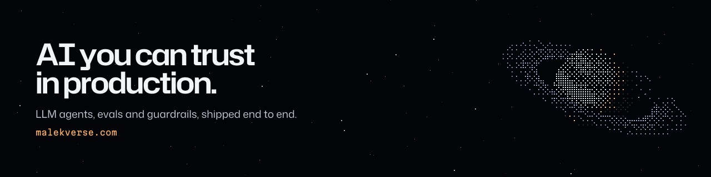

### Hi, I'm Malek

AI engineer building **AI you can trust in production**: LLM agents with guardrails, evaluation harnesses, and RAG that sticks to its sources.

`STATUS: SHIPPING` · Full Stack AI Engineer at **Korbyx** · [malekverse.com](https://malekverse.com)

---

#### Selected work

| Project | What it is | How it earns trust |
|---|---|---|
| [**QTrust**](https://q-trust-saas.vercel.app) | Multi-tenant SaaS for Quranic schools + tablet app for QR attendance | Admin agent with ~43 tools: Zod-validated arguments, every write held for human approval |
| [**Bridge**](https://bridgeforall.vercel.app) | Accessibility platform for neurodivergent & disabled users (EN/FR/AR) | Validated LLM output with multi-provider fallback · 19 automated row-level-security checks |
| [**Edah Studio**](https://edah-studio.onrender.com/) | Written lecture → narrated Arabic/English video with a 3D presenter | 5-layer faithfulness pipeline so the model can't invent facts |
| [**Win El Dhaw**](https://win-el-dhaw.vercel.app) | Live crowdsourced power-outage map for Tunisia | Reports from web, Telegram and news merged with DBSCAN clustering on PostGIS |
| [**quran-dataset**](https://github.com/malekverse/quran-dataset) | Structured open dataset of the Qur'an (JSON/CSV) | Open data for Arabic and Islamic tech |

Open source: merged fix in [God's Eye View](https://github.com/bilawalsidhu/gods-eye-view) (~46k ★).

#### Stack
`TypeScript` `Next.js` `React` `Node.js` `Hono` `Python` `FastAPI` `PostgreSQL` `MongoDB` `Supabase` `AWS` `Bedrock` `Terraform` `Vercel AI SDK` `LangChain` `ONNX Runtime`

#### Elsewhere
[LinkedIn](https://www.linkedin.com/in/malek-maghraoui) · [malekverse.com](https://malekverse.com)
